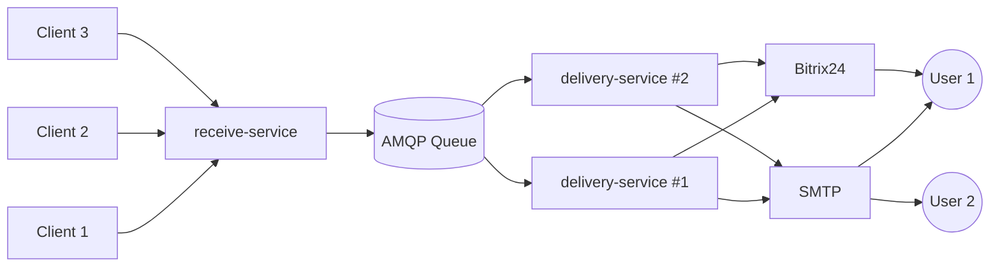

# Архитектура платформы уведомлений

Этот документ описывает концептуальную архитектуру **микросервисной платформы** уведомлений — цели, структуру, ключевые принципы и роли компонентов.

Он предназначен для:

- новых разработчиков,
- архитекторов,
- DevOps-инженеров,
- команд, интегрирующих платформу в свои системы.

> 💡 Документ фокусируется на **«почему» и «как в целом»**, объясняя выбор паттернов и разделение ответственности.

## Цель проекта

Платформа обеспечивает надёжную, масштабируемую и типобезопасную доставку транзакционных уведомлений через различные каналы (Email, Bitrix24, SMS, Push и др.).

**Ключевая особенность архитектуры — разделение ответственности между приёмом и доставкой и управление логикой через стратегии.**

Вместо монолитного процесса отправки, система разделена на два независимых контура:

1.  **Приём (Ingestion):** Быстрая валидация и постановка в очередь (`receive-service`).
2.  **Доставка (Delivery):** Асинхронная обработка очереди с применением стратегий маршрутизации (`delivery-service`).

Такое разделение позволяет:

- **Горизонтально масштабировать компоненты независимо:** При росте нагрузки можно увеличить количество инстансов воркеров доставки (`delivery-service`), не трогая шлюз (`receive-service`), и наоборот.
- **Изолировать сбои:** Проблемы с внешними каналами (SMTP, Bitrix API) влияют только на скорость обработки очереди, но не блокируют приём новых запросов от клиентов.
- **Гибко управлять приоритетами:** Критичные уведомления можно направлять в отдельные очереди с выделенными воркерами.

### Управление доставкой через стратегии

Логика доставки не зашита жестко в код, а определяется динамически через стратегии (`strategy`), выбираемые на уровне каждого запроса:

- **Гибкость:** Клиент сам определяет критерий успеха (`send_to_first_available`, `send_to_all_available` и др.) в зависимости от важности уведомления.
- **Отказоустойчивость:** Стратегии обеспечивают устойчивость к сбоям отдельных каналов (например, автоматический фолбэк на другой контакт или повторная попытка).
- **Расширяемость (Open/Closed):** Добавление нового сценария доставки требует только создания новой стратегии-класса без изменения ядра воркера.

### Экосистема каналов

Архитектура изначально спроектирована для бесшовного расширения списка каналов:

- Подключение нового провайдера (например, Telegram) требует лишь реализации адаптера канала.
- Все адаптеры регистрируются через Dependency Injection и становятся доступны всем инстансам воркеров автоматически.

## Структура проекта

Платформа реализована как **монорепозиторий**, содержащий общие библиотеки и независимые микросервисы:

```text
notification-platform/
├── core/                   # Shared Kernel: доменные типы, интерфейсы и константы (DDD)
├── packages/               # Переиспользуемые библиотеки (Shared Libraries)
│   ├── http                # Инфраструктурный слой: Express, middleware auth, telemetry
│   ├── amqp                # Абстракция над брокером сообщений (RabbitMQ)
│   └── telemetry           # Наблюдаемость: OpenTelemetry, логирование, метрики
├── services/               # Микросервисы (независимые deploy-единицы)
│   ├── receive-service     # API Gateway: HTTP-шлюз, валидация, публикация в AMQP
│   └── delivery-service    # Background Worker: потребление очереди, стратегии, отправка
├── infra/                  # Инфраструктурные конфиги (Docker, K8s, RabbitMQ policies)
└── docs/                   # Архитектурная документация, ADR, гайдлайны
```

### Роли компонентов

| Компонент              | Роль                                                                                                                                        | Масштабирование                                                                                |
| :--------------------- | :------------------------------------------------------------------------------------------------------------------------------------------ | :--------------------------------------------------------------------------------------------- |
| **`core`**             | Единый источник истины для типов, интерфейсов и контрактов, обеспечивающий строгую типизацию и согласованность данных между микросервисами. | Не масштабируется, используется при сборке сервисов.                                           |
| **`receive-service`**  | Stateless HTTP-шлюз. Принимает запросы, валидирует, обогащает и публикует события в очередь. Не знает о логике отправки.                    | Горизонтальное (за балансировщиком нагрузки). Зависит от скорости сети и CPU.                  |
| **`delivery-service`** | Stateful Worker. Забирает сообщения из очереди, применяет стратегии, вызывает адаптеры каналов.                                             | Горизонтальное (конкурирующие потребители). Зависит от скорости внешних API и лимитов каналов. |
| **`packages/*`**       | Общие библиотеки. Обеспечивают единый стандарт кода, типов и инструментов наблюдаемости.                                                    | Не масштабируются, используются при сборке сервисов.                                           |
| **AMQP Broker**        | Буфер надежности. Гарантирует сохранность сообщений при пиковых нагрузках или простое воркеров.                                             | Вертикальное / Кластеризация (управляется отдельно).                                           |

## Архитектурные принципы

Архитектура платформы реализована в формате **монорепозитория с независимыми микросервисами**. Такое решение позволяет переиспользовать общую доменную логику и инфраструктурные пакеты, сохраняя при возможность независимого развертывания и масштабирования сервисов (`receive-service`, `delivery-service`).

Разработка ведется в соответствии со следующими ключевыми принципами:

1. **Shared Kernel (DDD)**
   Пакет `@notification-platform/core` содержит строго типизированные доменные модели (`Notification`, `Contact`, `ChannelType`), которые используются как производителем (`receive-service`), так и потребителем (`delivery-service`).

2. **Чистая архитектура**
   Бизнес-логика (`domain`) полностью независима от инфраструктуры. Внешние зависимости (HTTP, очереди, каналы) подключаются через порты и адаптеры.

3. **Расширяемость через DI и стратегии**
   Поведение сервиса (например, выбор канала доставки) определяется стратегиями, инжектируемыми через DI-контейнер. Это позволяет добавлять новые каналы или менять логику без изменения ядра.

4. **Следование 12-Factor**
   Сервис stateless, конфигурируется через переменные окружения, пишет логи в stdout и готов к развёртыванию в облачных средах с CI/CD.

## Диаграмма компонентов



## Стратегия доставки уведомлений

**Стратегия — это ключевая архитектурная фича сервиса, определяющая алгоритм взаимодействия с каналами связи для каждого конкретного уведомления.**

Вместо жестко зашитой логики отправки, сервис делегирует решение о том, как и когда считать доставку успешной, самому клиенту через параметр `strategy`. Это позволяет решать разные бизнес-задачи в рамках одного API:

- **Устойчивость к сбоям каналов:** Стратегии автоматически обрабатывают ошибки внешних провайдеров (SMTP, Bitrix API). Если один канал недоступен, система может переключиться на другой или повторить попытку, обеспечивая доставку без вмешательства человека.
- **Гибкость критериев успеха:** Клиент сам выбирает баланс между скоростью/экономией (`send_to_first_available`) и максимальной надежностью (`send_to_all_available`).
- **Расширяемость без изменения ядра:** Новые алгоритмы доставки (например, «отправить в Bitrix, если Email не доставлен») реализуются как отдельные модули-стратегии и подключаются через DI, не требуя правок в бизнес-логике.

> 📘 Детальное описание доступных стратегий, их алгоритмов и сценариев использования — в документе [`strategies.md`](./strategies.md).

## API сервиса

Сервис предоставляет **RESTful HTTP API** для управления доставкой уведомлений. Взаимодействие строится вокруг двух основных сценариев:

1. Отправка уведомлений:

- `POST /api/v1/notifications` — отправка одиночного уведомления.
- `POST /api/v1/notifications/batch` — пакетная отправка (до 50 уведомлений в одном запросе) с поддержкой частичного успеха (`207 Multi-Status`).

2. Наблюдаемость и здоровье:

- `GET /health/live` — Liveness probe (проверка живости процесса).
- `GET /health/ready` — Readiness probe (проверка готовности зависимостей: SMTP, Bitrix, очереди).

**Безопасность:** Все бизнес-эндпоинты защищены JWT-аутентификацией (Bearer token).

> Полная спецификация API (форматы, статусы, примеры) — в документе [`api.md`](./api.md).

## Очередь сообщений

Взаимодействие между сервисами приёма и доставки осуществляется асинхронно через брокер сообщений **AMQP** (RabbitMQ). Очередь выступает в роли буфера надежности, развязывающего пики входящего трафика и скорость обработки внешними каналами.

**Ключевые характеристики:**

- **Гарантия доставки (At-Least-Once):** Сообщения сохраняются в очереди до момента успешного подтверждения обработки (`ACK`) воркером. При сбое воркера сообщение возвращается в очередь и передается другому доступному инстансу.
- **Competing Consumers:** Несколько инстансов `delivery-service` подписываются на одну очередь. Брокер автоматически распределяет сообщения между ними по принципу `round-robin`, обеспечивая горизонтальное масштабирование обработки.
- **Изоляция сбоев:** Если внешние каналы (SMTP, Bitrix) недоступны или работают медленно, очередь накапливает сообщения, предотвращая потерю данных и позволяя шлюзу (`receive-service`) продолжать принимать новые запросы без задержек.
- **Мертвые очереди (DLQ):** Сообщения, многократно вызвавшие ошибку обработки, автоматически перемещаются в **Dead Letter Queue** для последующего ручного анализа, не блокируя основной поток.

Конфигурация очередей (имена, параметры долговечности, лимиты) управляется централизованно через пакеты инфраструктуры.

> Детальное описание топологии очередей, политик retry и настройки DLQ — в документе [queue.md](./queue.md).

## Управление инфраструктурой как кодом (IaC)

Для обеспечения консистентности между кодом приложения и окружением, критические параметры инфраструктуры вынесены в отдельный слой конфигурации (`infra/`) внутри монорепозитория. Это реализует принцип **Application-Owned Infrastructure**: команда разработки владеет логическими контрактами системы, а операционная команда — ресурсами её запуска.

### Разделение ответственности

Архитектура четко разделяет два типа настроек:

1. Логические контракты:

- **Топология очередей:** Имена `exchanges`, `queues`, `bindings`, стратегии `Dead Lettering` и политики `TTL`. Изменение этих параметров требует синхронного обновления кода сервисов.
- **Политики доступа:** Роли, клиенты и права доступа для `S2S`-взаимодействия.
- **Правила шлюза:** Маршруты `API`, стратегии `Rate Limiting` и таймауты.
- _Принцип:_ Эти файлы версионируются вместе с кодом. Любое изменение здесь считается Breaking Change для сервиса.

2. Операционные настройки (в отдельном репозитории инфраструктуры):

- Ресурсы Kubernetes/Docker Swarm и т.д. (CPU, RAM, лимиты).
- Сетевые политики, Ingress-контроллеры кластера, секреты производства.
- Масштабирование самого брокера сообщений.
- _Принцип:_ Эти настройки адаптируют логические контракты под конкретное окружение (Dev/Prod) без изменения бизнес-логики.

> Детальное описание структуры конфигов, правил их изменения и жизненного цикла — в [README.md](../../infra/README.md).

## Телеметрия

Сервис обеспечивает полную прозрачность работы через три столпа наблюдаемости: **логи, метрики и распределённые трейсы**, унифицированные стандартом **OpenTelemetry (OTel)**.

Сбор телеметрии полностью отделен от бизнес-логики. Инструментирование реализуется через функциональные декораторы (`withLogging`, `withMetering`), которые оборачивают использование портов и сценарии использования. Это гарантирует, что сбои в системе мониторинга не повлияют на доставку уведомлений.
Каждому запросу присваивается уникальный `Trace ID`, позволяющий отследить полный путь уведомления через все компоненты системы (HTTP → Очередь → Стратегия → Внешний канал).

Все данные экспортируются в **OTel Collector**, который отвечает за их агрегацию, обогащение и маршрутизацию в бэкенды хранения (Prometheus, Tempo, Loki).

> Подробности метрик, атрибутов и форматов — в документе [`telemetry.md`](./telemetry.md).

## Перспективы развития

Архитектура сервиса заложена с расчётом на эволюцию. Ниже — ключевые шаги развития, которые либо уже подготовлены текущей структурой, либо запланированы на ближайшее будущее:

### 1. Оркестрация через Kubernetes

Текущая контейнеризация и соответствие принципам stateless (логирование в stdout, наличие healthcheck’ов) позволяют бесшовно перенести сервис в Kubernetes. Это даст автоматическое масштабирование под нагрузкой и самовосстановление при сбоях узлов.

### 2. Гарантия идемпотентности

Чтобы исключить дублирование уведомлений при сетевых сбоях или повторных отправках клиента, будет реализована проверка по ключу идемпотентности (`Idempotency-Key`). Механизм будет использовать быстрое хранилище с TTL (например, Redis) для проверки уникальности запроса перед запуском логики, что гарантирует доставку сообщения ровно один раз даже в нестабильной сети.
