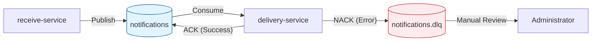

# Очередь сообщений (AMQP)

Этот документ описывает топологию очередей, политику доставки сообщений и механизм обработки ошибок в платформе уведомлений.

Взаимодействие между `receive-service` (Producer) и `delivery-service` (Consumer) построено на базе брокера сообщений **AMQP** (RabbitMQ). Архитектура очередей спроектирована максимально просто и надежно: вся сложная логика повторных попыток (retry) вынесена на уровень бизнес-стратегий, а очередь выполняет роль гарантированного транспорта.

---

## 🏗 Топология очередей

В системе используются всего две очереди:

| Имя очереди | Тип | Назначение |
| :--- | :--- | :--- |
| `notifications` | **Main Queue** | Основная очередь для всех валидных уведомлений, ожидающих доставки. |
| `notifications.dlq` | **Dead Letter Queue** | Очередь «мертвых» писем. Сюда попадают сообщения, которые не удалось обработать с первой попытки. |

### Схема потока данных

---

## ⚙️ Принцип работы

### 1. Публикация (Producer)
`receive-service` после успешной валидации запроса публикует сообщение в очередь `notifications`.
- **Режим подтверждения:** Сообщения публикуются с флагом `persistent` (доставляются на диск), чтобы пережить перезапуск брокера.
- **Маршрутизация:** Используется стандартный exchange с routing key `notifications`.

### 2. Потребление (Consumer)
`delivery-service` подписывается на очередь `notifications` в режиме **Competing Consumers**.
- Несколько инстансов воркера конкурируют за сообщения. Брокер отправляет каждое сообщение только одному свободному воркеру.
- **Ручное подтверждение (Manual ACK):** Воркер **не** отправляет автоматическое подтверждение (`autoAck: false`). Подтверждение (ACK) отправляется только после того, как стратегия доставки успешно завершит свою работу.
- **Учет попыток (Retry Count):** При каждом получении сообщения из очереди воркер читает и инкрементирует заголовок `x-retry-count`. Если заголовок отсутствует (первая попытка), он инициализируется значением `1`.

---

## ❌ Обработка ошибок и Dead Letter Queue (DLQ)

Ключевая особенность архитектуры — **отсутствие автоматических повторных попыток (retry) на уровне брокера**.

### Почему так?
Логика устойчивости к сбоям полностью инкапсулирована внутри **Стратегий доставки** (`delivery-service`).
- Если стратегия видит временную ошибку (например, таймаут SMTP), она сама решает сделать повторную попытку внутри процесса обработки.
- Если стратегия исчерпала лимит попыток или получила критическую ошибку (например, неверный формат контакта), она возвращает результат «Ошибка».

### Механизм попадания в DLQ
Если воркер `delivery-service` завершает обработку сообщения с ошибкой (выбрасывает исключение или явно вызывает `nack`):
1.  Брокер получает сигнал `NACK` (Negative Acknowledgement) с флагом `requeue: false`.
2.  Сообщение **не возвращается** в основную очередь (чтобы избежать бесконечного цикла ошибок и блокировки очереди).
3.  Благодаря настройке `deadLetterExchange`, сообщение автоматически перемещается в очередь `notifications.dlq`.

> ⚠️ **Важно:** Сообщение попадает в DLQ сразу после первого неудачного завершения обработки на уровне воркера. Вся ответственность за внутренние retry лежит на коде стратегии.

---

## 🛠 Ручная обработка (Admin Workflow)

Сообщения в очереди `notifications.dlq` требуют ручного вмешательства. Автоматическая доставка из этой очереди не предусмотрена.

**Сценарий работы администратора:**
1.  **Мониторинг:** Администратор отслеживает длину очереди `notifications.dlq` через дашборд RabbitMQ Management или алерты в системе мониторинга.
2.  **Анализ:** Сообщение извлекается из DLQ для анализа причин ошибки (через UI RabbitMQ или специальные скрипты). Частые причины:
    *   Недоступность внешнего сервиса в течение долгого времени.
    *   Некорректные данные, прошедшие первичную валидацию (edge cases).
    *   Баги в коде стратегии.
3.  **Действие:**
    *   **Исправить и вернуть:** Если проблема временная или данные можно исправить, сообщение публикуется обратно в очередь `notifications` (через UI или скрипт).
    *   **Отклонить:** Если сообщение неисправимо (например, удаленный пользователь), оно удаляется из DLQ.