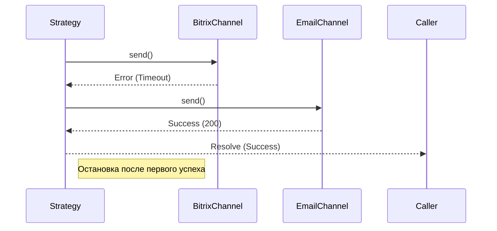
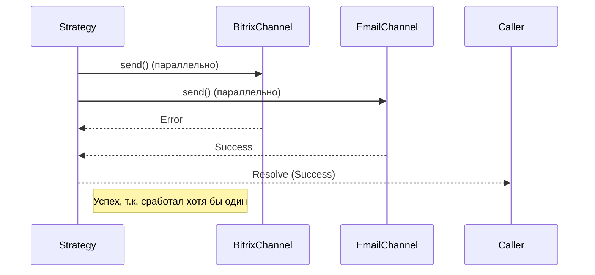
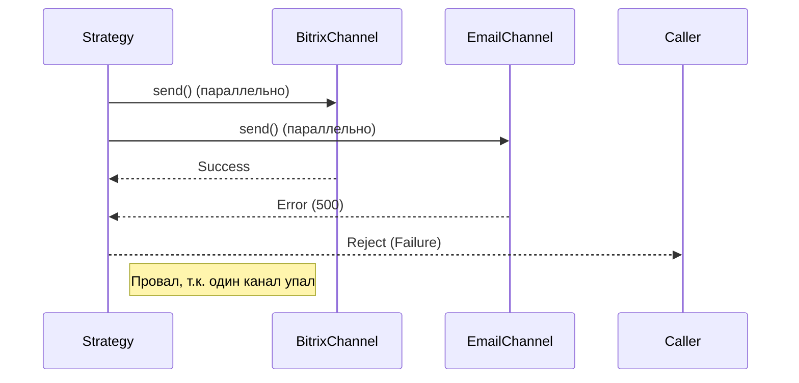

# 📦 Стратегии доставки уведомлений

Этот документ описывает **доступные стратегии доставки**.  
Стратегии определяют алгоритм обработки массива контактов получателя, позволяя гибко управлять надежностью доставки и потреблением ресурсов без изменения кода ядра.

---

## 🧩 Общая концепция

Сервис поддерживает **динамический выбор стратегии** на уровне каждого уведомления через поле `strategy`.

```json
{
  "contacts": [
    { "type": "email", "value": "user@example.com" },
    { "type": "bitrix", "value": 12345 }
  ],
  "message": "Важное уведомление",
  "strategy": "broadcast"
}
```

Если поле не указано, используется стратегия по умолчанию: **`sequence`**.

Вот обновлённый раздел, который точно отражает вашу текущую реализацию через абстрактный класс и объясняет **почему** выбран именно такой подход:

### Контракт стратегии

Все стратегии наследуются от абстрактного базового класса `Strategy`, который определяет контракт выполнения и предоставляет общую инфраструктуру для построения попыток доставки:

```ts
export abstract class Strategy {
  protected abstract readonly type: Mode;

  abstract execute(
    notification: Notification,
    channels: readonly Channel[],
  ): Promise<void>;

  protected getAttempts(
    channels: readonly Channel[],
    contacts: readonly Contact[],
  ): Attempt[];
}
```

- **`execute()`** — единственный публичный метод контракта. Принимает уведомление и набор доступных каналов, возвращает `Promise<void>`:
  - Резолв → критерий стратегии выполнен (уведомление доставлено согласно правилам).
  - Реджект → критерий не выполнен, ошибка пробрасывается на уровень воркера для обработки (ретрай / DLQ).
- **`getAttempts()`** — защищённый хелпер, формирующий плоский список пар `{channel, contact}` с учётом совместимости. Инкапсулирует рутинную логику матчинга, чтобы конкретные стратегии фокусировались только на **порядке и условиях** отправки.
- **`type: Mode`** — идентификатор стратегии (`broadcast`, `race` и др.), используемый фабрикой для выбора реализации по запросу клиента.

> ⚠️ **Принцип устойчивости:** Стратегия сама решает, является ли сбой отдельного канала фатальным для всего уведомления. Например, `race` может игнорировать ошибки проигравших каналов, а `broadcast` — требовать успеха всех. Эта логика не выносится на уровень воркера, что сохраняет стратегию самодостаточной единицей политики доставки.

---

## 1. `sequence`

### 🎯 Назначение

**Экономия ресурсов.** Отправить уведомление первым успешным способом и немедленно остановиться.

> **Логика:** «Попробуй каналы по очереди. Как только один сработал — задача выполнена».

### 🔍 Алгоритм

1. Перебирает контакты и поддерживающие их каналы **последовательно**.
2. Выполняет отправку в первый подходящий канал.
3. При **успехе** — немедленно завершает работу (остальные каналы игнорируются).
4. При **ошибке** — переходит к следующему каналу.
5. Если все каналы вернули ошибку — стратегия выбрасывает исключение.

### 📈 Диаграмма последовательности



### ✅ Когда использовать

- Повседневные уведомления (статусы задач, комментарии).
- Когда достаточно доставить сообщение **любым одним способом**.
- Для экономии лимитов внешних API и снижения нагрузки.

---

## 2. `race`

### 🎯 Назначение

**Максимальная вероятность доставки.** Попытаться отправить во все каналы, но считать операцию успешной, если сработал **хотя бы один**.

> **Логика:** «Попробуй везде. Если хоть куда-то дошло — отлично. Ошибки отдельных каналов не критичны».

### 🔍 Алгоритм

1. Запускает отправку во все подходящие каналы **параллельно**.
2. Собирает результаты всех попыток.
3. Если **хотя бы один** канал вернул успех — стратегия завершается успешно (`Resolve`).
4. Если **все** каналы вернули ошибку — стратегия выбрасывает исключение (`Reject`).
5. Частичные ошибки (например, Bitrix упал, а Email ушел) **игнорируются**.

### 📈 Диаграмма последовательности



### ✅ Когда использовать

- Важные уведомления, где критично, чтобы пользователь получил их **любым путем**.
- Ситуации с нестабильными каналами связи (страховка от временных сбоев SMTP или API Bitrix).
- Алерты для ответственных лиц.

---

## 3. `broadcast`

### 🎯 Назначение

**Строгая гарантия доставки (Strict Consistency).** Требует успешной отправки **во все** указанные каналы.

> **Логика:** «Или всем, или никому. Если хоть один канал упал — всё уведомление считается неудачным».

### 🔍 Алгоритм

1. Запускает отправку во все подходящие каналы.
2. Собирает результаты всех попыток.
3. Если **все** каналы вернули успех — стратегия завершается успешно (`Resolve`).
4. Если **хотя бы один** канал вернул ошибку — стратегия **немедленно считает операцию проваленной** и выбрасывает исключение (`Reject`).

> ⚠️ Эта стратегия наименее устойчива к сбоям отдельных провайдеров, но гарантирует, что пользователь получит сообщение во всех запланированных каналах.

### 📈 Диаграмма последовательности



### ✅ Когда использовать

- Юридически значимые уведомления (требуется подтверждение получения всеми способами).
- Синхронизация статусов, где важно состояние во всех системах одновременно.
- Сценарии, где частичная доставка может ввести пользователя в заблуждение.

---

## 🧰 Расширение системы

Добавление новой стратегии не требует изменения ядра сервиса.

1. Реализуйте класс, наследующий абстрактный класс `Strategy`.
2. Зарегистрируйте его в DI-контейнере.
3. Добавьте новое значение в enum `Mode`.

---

## 📌 Сравнительная таблица

| Характеристика               | `sequence`              | `race`                       | `broadcast`                  |
| :--------------------------- | :---------------------- | :--------------------------- | :--------------------------- |
| **Критерий успеха**          | Первый успешный канал   | Хотя бы один успешный        | **Все** каналы успешны       |
| **Реакция на ошибку канала** | Игнорирует, идет дальше | Игнорирует (если есть успех) | **Проваливает всю операцию** |
| **Нагрузка на каналы**       | Минимальная             | Средняя/Высокая              | Высокая                      |
| **Гарантия доставки**        | Базовая                 | Высокая (Resilient)          | Строгая (Consistent)         |
| **Сценарий**                 | Обычные уведомления     | Важные алерты                | Критичные/Юридические данные |

> 💡 **Рекомендация:**  
> Используйте `sequence` для 90% задач.  
> Подключайте `race` для важных событий.  
> `broadcast` используйте только там, где бизнес-логика требует строгой консистентности по всем каналам.
